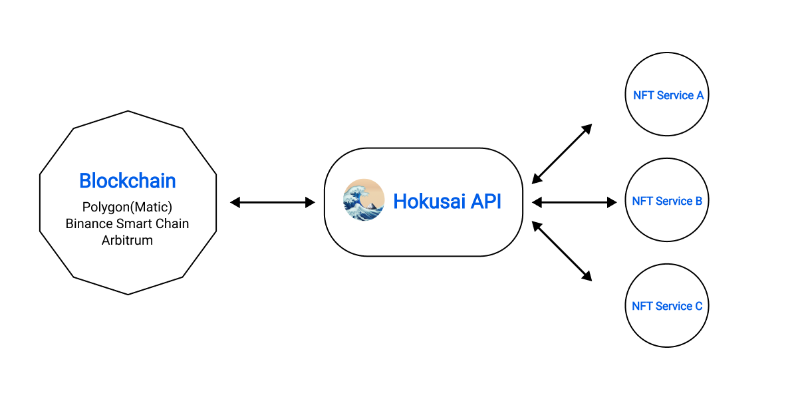

  
  
  
  

Hokusai APIは、NFTを活用できるAPIを提供します。Hokusai APIを使用すると**誰でも簡単に**NFTの発行・ロイヤリティの設定を既存のWEBサービスに導入するこができます。
## Hokusai APIについて
  
Hokusai APIは、誰でも簡単にNFTを導入することが可能なNFT専用のAPIです。
  
--- 
## Hokusai APIでできること
### 1.NFTの発行
Hokusai APIでは、NFTの発行をすることが可能になります。
詳しくは[こちら](/nft/mint-nft)を御覧ください。
### 2.ロイヤリティの設定
--- 
## Hokusai APIの主な利点
### - 開発者にやさしい設計
#### Open API
Hokusai APIでは、ブロックチェーンネットワークと簡単にやりとりが可能なRESTful APIを提供しています。
ブロックチェーンの知識なく、既存のWEBサービスに導入ができます。  
Hokusai APIはREST APIであり、HTTPSで通信します。HTTPSをサポートすると、簡単にAPIを呼び出すことが可能になります。

APIを呼び出す際には、有効なAPI keyとAPI secretが必要になります。APIをご利用になりたい方は、[こちら](http://example.com/)からAPI Keyの発行申請を行ってください。

#### 柔軟なサポート体制
またHokusai APIではDiscordサーバーを用意しています。Discordサーバーでは、Hokusaiチームに気軽に質問や問い合せなどのサポートを受けることが可能です。  
[こちら](https://discord.gg/34fmuE25G2)からご参加ください。
   
   
### - 利用ユーザーにやさしい設計
NFTを購入・発行するためには、

**1. 取引所に口座を開設**  
**2. 日本円を入金**  
**3. レートもよくわからないまま必要な暗号資産を購入**  
**4. マーケットプレイスに行ってNFTを購入・発行**  

以上のステップを踏む必要があります。

Hokusai APIを利用すれば、暗号資産を購入する必要がなくなり、**1.~3.のステップを簡略化する事ができます**。  
利用ユーザーはハードルの高い暗号資産の準備をする必要がなくなり、簡単にNFTへの購入・発行することが可能になります。

### 3.GAS代（ネットワーク手数料）が無料
Hokusai APIの利用者は、どんなプランを利用していてもNFTの発行と送信にかかるGAS代が完全に無料です。
昨今GAS代の高騰が話題になりましたがHokusai APIでは、GAS代が一切かかりません。
--- 

## Hokusai APIを利用してNFTプラットフォームを開発しよう！
### 1.API key発行申請を行う
### 2.Hokusai API ドキュメントを読む

